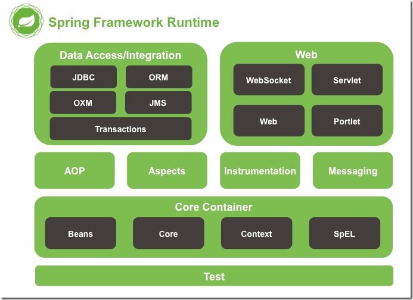
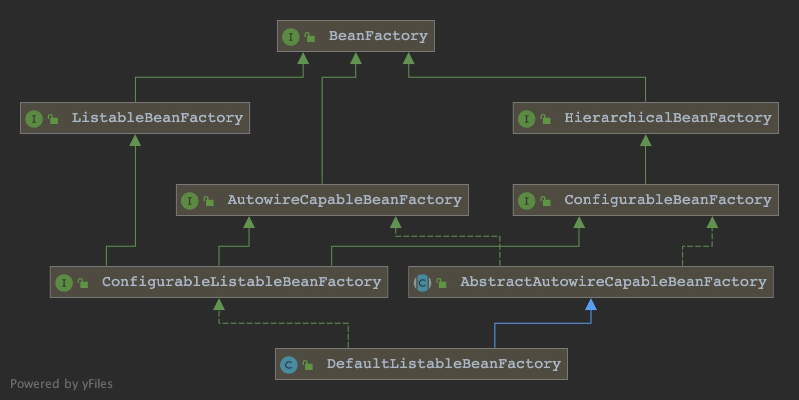
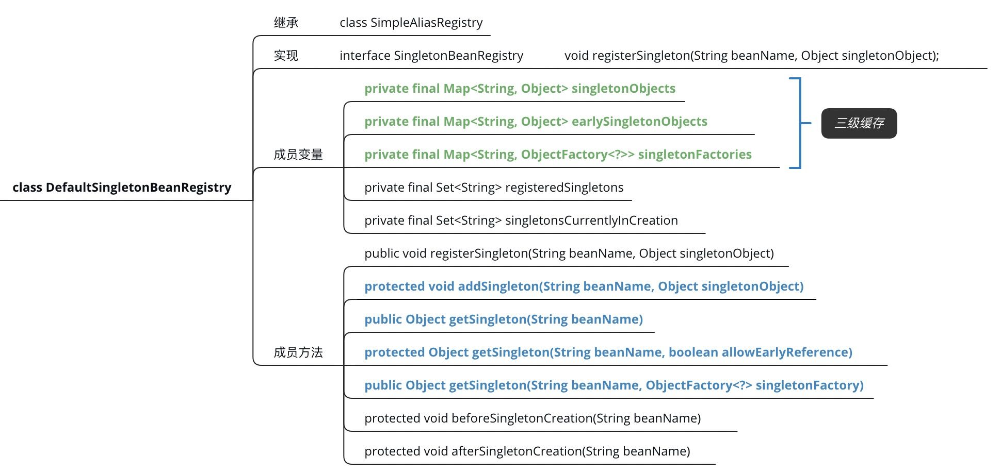
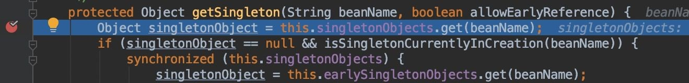
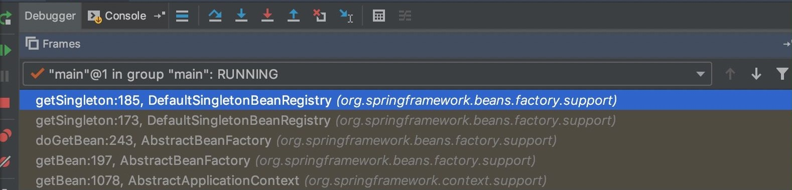
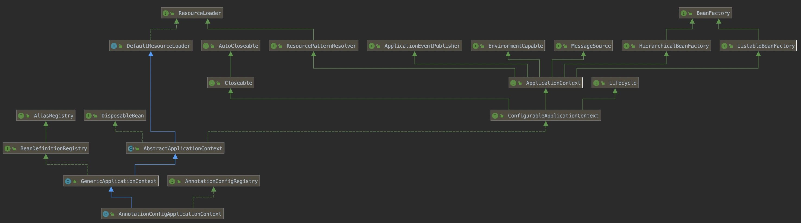
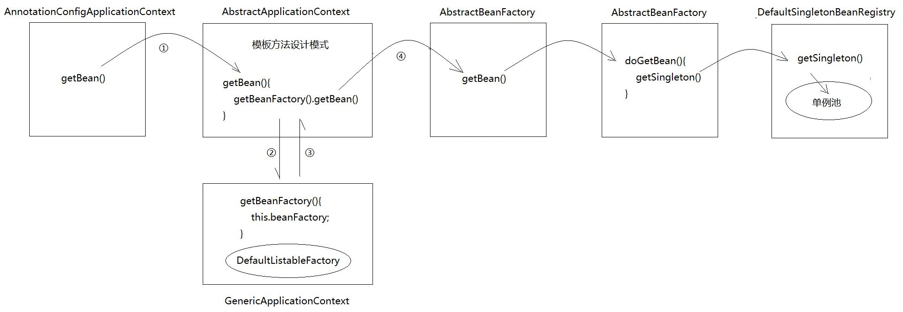

# Sprint-Beans 源码阅读

## 1 写在最前面

在选修这门课之前，笔者的面向对象编程知识几乎为零，或者说，完全没有“面向对象”的概念。由于学校课程体系的安排，在过去的三年中笔者主要接触的是C这类面向过程的语言。可以说，这次源码阅读是一次从零开始的学习过程。在选择题目时，固然笔者对更复杂的系统有着更多好奇，但还是希望能从基础一点的项目入手，希望能够通过阅读原码管窥顶级Coder们的设计思路，借此学习建立“面向对象”的思想。

## 2 Spring Framework简介

### 2.1 Spring Framework特性与历史

在查阅资料时，笔者看到了一个很有意思的说法：“我得出一个公式：Spring = 春天 = Java程序员的春天 = 简化开发。最后的简化开发正是Spring框架带来的最大好处。”

事实确实如此，Spring确实为Java带来了春天。它是于2003 年兴起的一个轻量级的Java 开发框架。由Rod Johnson创建，其前身为Interface21框架，后改为了Spring并且正式发布。Spring是为了解决企业应用开发的复杂性而创建的。它解决的是业务逻辑层和其他各层的松耦合问题，因此它将面向接口的编程思想贯穿整个系统应用。框架的主要优势之一就是其分层架构，分层架构允许使用者选择使用哪一个组件，同时为 J2EE 应用程序开发提供集成的框架。Spring使用基本的JavaBean来完成以前只可能由EJB完成的事情。然而，Spring的用途不仅限于服务器端的开发。从简单性、可测试性和松耦合的角度而言，任何Java应用都可以从Spring中受益。简单来说，Spring是一个分层的JavaSE/EE full-stack(一站式) 轻量级开源框架。Spring 的理念：不去重新发明轮子。其核心是控制反转（IOC）和面向切面（AOP）。

在2002年10月，由Rod Johnson 编著的书名为《Expert One-to-One J2EE Design and Development》一书中，对Java EE 系统框架臃肿、低效、脱离现实的种种现状提出了质疑，并阐述了 J2EE 使用 EJB 开发设计的优点及解决方案，他提出了一个基于普通 Java 类和依赖注入的更简单的解决方案。然后以此书为指导思想，他编写了interface21框架，这是一个力图冲破J2EE传统开发的困境，从实际需求出发，着眼于轻便、灵巧，易于开发、测试和部署的轻量级开发框架。Spring框架即以interface21框架为基础，经过重新设计，并不断丰富其内涵，于2004年3月24日，发布了1.0正式版。同年他又推出了一部堪称经典的力作《Expert one-on-one J2EE Development without EJB》，该书在Java世界掀起了轩然大波，不断改变着Java开发者程序设计和开发的思考方式。在该书中，作者根据自己多年丰富的实践经验，对EJB的各种笨重臃肿的结构进行了逐一的分析和否定，并分别以简洁实用的方式替换之。至此一战功成，Rod Johnson成为一个改变Java世界的大师级人物。值得注意的是，Rod Johnson是悉尼大学的博士，然而他的专业不是计算机，而是音乐学。

Spring框架自从发布以来就发展迅速，现在已经是最受欢迎的企业级 Java 应用程序开发框架，数以百万的来自世界各地的开发人员使用 Spring 框架来创建性能好、易于测试、可重用的代码。从2004发布的第一个Spring版本，到现在已经更新到第五个Spring版本了。

### 2.2 Spring模块

Spring框架包含的功能大约由20个小模块组成。这些模块按组可分为核心容器(Core Container)、数据访问/集成(Data Access/Integration)、Web、面向切面编程(AOP和Aspects)、设备(Instrumentation)、消息(Messaging)和测试(Test)。Spring官方文档中为这些模块画出了形象的示意图：



### 2.3 Spring 核心技术

Spring最核心的部分是控制反转（IOC）和面向切面编程（AOP）。由于本次源码阅读关注的模块是Spring-Beans，不包含AOP技术，故暂时略过AOP，重点介绍IOC。

在Spring的相关文档中，另一个概念：DI（Dependency Injection依赖注入）也被频频提及。其实，控制反转(IOC)和依赖注入(DI)是从不同的角度的描述的同一件事情，就是指通过引入IOC容器，利用依赖注入的方式，实现对象之间的解耦。其中IOC是个更宽泛的概念，而DI是更具象的概念。

具体而言，IOC技术就是，当用户使用对象调用一个方法或者类时，不是由用户主动去创建这个类的对象，而是将控制权交给Spring框架。说复杂点就是资源（组件）不再由使用资源双方进行管理，而是由不使用资源的第三方统一管理，这样带来的好处。第一，实现了资源的集中管理，增加了资源的可配置性和易管理程度。第二，降低了使用资源双方的依赖程度，也就是常说的耦合度。

而DI技术是指，由Spring框架主动创建被调用类的对象，然后把这个对象注入到用户自己的类中，使得用户可以直接使用它。

### 2.4 Spring-Beans模块简介

首先需要厘清的一点是——什么是bean？

bean这一命名不是Spring开创的，Java中bean的使用由来已久。同样是在查找资料的过程中，笔者找到了一段有意思的叙述：

“*想想 Java 的图标是什么？没错，是一杯咖啡。想想咖啡的原料是什么？没错，是咖啡豆（bean）。*”

在Java中，bean是一种特殊的，可重用的，私有的类。在Spring中也是如此。

在Spring中，Spring-Beans模块主要实现两方面功能，一是实现了一个通用的对象工厂，即BeanFactory，通过它，用户可以获取到所需的对象。二是担任全局的上下文，用户把某个对象丢进这个上下文，然后就可以在应用的任何位置获取到这个对象。

## 3 Spring Bean流程与实现
上文中提到Spring-Beans模块主要实现的一个功能是BeanFactory，即一个通用的对象工厂，通过它，用户可以获取到所需的对象。现在我们即从这个“工厂”下手，以期望一探Spring Bean中最关键的工作流程是如何实现的。 

BeanFactory源码如下：

``` java
public interface BeanFactory {

	String FACTORY_BEAN_PREFIX = "&";

	Object getBean(String name) throws BeansException;

	<T> T getBean(String name, Class<T> requiredType) throws BeansException;

	Object getBean(String name, Object... args) throws BeansException;

	<T> T getBean(Class<T> requiredType) throws BeansException;

	<T> T getBean(Class<T> requiredType, Object... args) throws BeansException;

	<T> ObjectProvider<T> getBeanProvider(Class<T> requiredType);

	<T> ObjectProvider<T> getBeanProvider(ResolvableType requiredType);

	boolean containsBean(String name);

	boolean isSingleton(String name) throws NoSuchBeanDefinitionException;

	boolean isPrototype(String name) throws NoSuchBeanDefinitionException;

	boolean isTypeMatch(String name, ResolvableType typeToMatch) throws NoSuchBeanDefinitionException;

	boolean isTypeMatch(String name, Class<?> typeToMatch) throws NoSuchBeanDefinitionException;

	@Nullable
	Class<?> getType(String name) throws NoSuchBeanDefinitionException;

	@Nullable
	Class<?> getType(String name, boolean allowFactoryBeanInit) throws NoSuchBeanDefinitionException;

	String[] getAliases(String name);

}
```

可以发现，BeanFactory内定义的方法，要么是“getBean”，即取出Bean；要么是“containsBean”，判断有没有Bean。唯独没有存入Bean。相当于，这个“工厂”在输出“产品”，我们可以通过它得到Bean，但没有存入“产品”，即我们没有在这里找到存入Bean的方法，类似“addBean”之类的字段。

实际上，BeanFactory是提供了一个方法规范，所有实现BeanFactory接口的子类必须实现getBean()方法。相当于指定了一套行业生产标准，比如我造一个路由器必须有一个wan口两个lan口。BeanFactory是一个接口，这个接口本身没有存储bean的功能，自然也不会有addBean之类的方法。

于是乎我们必须继续向下，顺藤摸瓜，分析一下BeanFactory的子接口和实现类：



可以发现，BeanFactory下子接口的默认实现类是DefaultListableBeanFactory，分析这个实现类，我们可以看到：



它已经实现了Bean的注册例如registerSingleton()方法。如此一来我们已经找到了目标，阅读注释和官方文档，其中的singletonObjects即为存放单例Bean的map，由名称映射到Bean的实例。而其余两级缓存则用于解决循环依赖。同样DefaultSingletonBeanRegistry也提供了registerSingleton()、addSingleton()等一系列提供Bean存取服务的方法。接下来就很简单了，我们只要找到这个实现类和BeanFactory的关系就可以了。 

问题来了，这个类没有实现getBean()方法。 

它没有实现BeanFactory。

怪哉！ 

明明我们已经找到了Bean的注册方法，也知道了获取Bean的方法即getBean()，两件很好的事结合到一起，怎么会变成现在这个样子呢？getBean()方法究竟是怎么抵达这个DefaultSingletonBeanRegistry的呢？

由于匮乏的想象力，笔者决定老老实实debug看调用栈。

首先我们给applicationContext.getBean()打断点并开始运行，然后找到
```java
DefaultSingletonBeanRegistry#getSingleton(String beanName, boolean allowEarlyReference)
```
打上断点，然后放开上面的断点，让程序停在getSingleton(...)方法：



得到调用栈如下：



现在再让我们来分析一下这个调用栈，可以大胆猜想，AnnotationConfigApplicationContext通过层层继承，最终继承了DefaultSingletonBeanRegistry，然后getBean()方法在某一处调用了getSingleton()，最终从earlySingletonObjects拿到bean。

但是检查类继承图：



AnnotationConfigApplicationContext和DefaultSingletonBeanRegistry没有任何关系！

但是转念一想，除了继承，还有办法使用父类方法访问父类变量吗？

有，组和/聚合。把整个对象直接塞到另一个对象中，这样暴力的方式导致两者没有继承关系，在继承图上也找不到两者的任何联系。

为了验证我们的猜想，我们直接点开applicationContext.getBean()，来到了AbstractApplicationContext，可以直接发现这样的注释与实现：
```java
//----------------------------------------------------------------
// Implementation of BeanFactory interface
//----------------------------------------------------------------

@Override
public Object getBean(string name) throws BeansException {
	assertBeanFactorvActive();
	return getBeanFactory() . getBean(name);
}
...
```
相当于AbstractApplicationContext直接在内部实现了BeanFactory，就有了getBean()方法。实际上，AnnotationConfigApplicationContext#getBean()整个过程是这样的：



在这里，DefaultListableBeanFactory实际上充当了一个“中介”的作用，之前的疑惑便都可以解答了。

## 4 Spring Bean中的设计模式

### 4.1 设计模式定义

在这部分开始之前，我们有必要回顾一下，什么是设计模式呢？

总的来说，设计模式（Design Pattern）是一种设计思维的高度抽象，就像算法可以被理解为解决一些特定计算问题的思路的抽象一样，设计模式也可以被理解为一种解决设计问题的思路的抽象。设计模式的概念非常具有哲学意味，很容易联想到柏拉图哲学理论中被频频提及的“理型”概念，所谓理型，即时现实事物在人的理性思维中投射的完美“模板”，如果把现实事物比作姜饼的话，“理型”即是对应的姜饼模具。尽管现实中的姜饼可能形态各异，但它们身上都可以看到姜饼模具的影子，这就是代码复用性（笑）。

具体来说，设计模式是一套被反复使用、多数人知晓的、经过分类编目的、代码设计经验的总结。使用设计模式是为了可重用代码、让代码更容易被他人理解、保证代码可靠性。 毫无疑问，运用设计模式无论对于项目本身，还是对于项目作者，还是对于阅读项目的读者来说，都是多赢的。可以说，设计模式使代码编制真正“工程化”。从某种程度上说，每种模式在现实中都有相应的原理来与之对应，每一个模式描述了一个在我们周围不断重复发生的问题，以及该问题的核心解决方案。正如上文所说的，设计模式是一种设计问题解决方案的高度抽象，如柏拉图所言的现实事物在人的理性思维中呈现的完美“模板”，正因如此，设计模式才能在众多项目中被反复使用，同时取得良好效果。

### 4.2  Spring Bean中体现的设计模式

回顾我们之前的debug过程，我们一路经过了DefaultSingletonBeanRegistry，AbstractApplicationContext等等重要类，它们都蕴含一些典型的设计模式。

#### 4.2.1 单例模式

单例模式可以确保系统中某个类只有一个实例，该类自行实例化并向整个系统提供这个实例的公共访问点，除了该公共访问点，不能通过其他途径访问该实例。单例模式的优点在于：

- 系统中只存在一个共用的实例对象，无需频繁创建和销毁对象，节约了系统资源，提高系统的性能
- 可以严格控制客户怎么样以及何时访问单例对象。

更具体而言，实现单例的方法主要有两种，饿汉式与懒汉式。饿汉式是在类加载时，就将单例初始化完成，保证获取实例的时候，单例是已经存在的了。所以在第一次调用时速度也会更快，因为其资源已经初始化完成。懒汉式会延迟加载，只有在首次调用时才会实例化单例，如果初始化所需要的工作比较多，那么首次访问性能上会有些延迟，不过之后就和饿汉式一样了。

在Spring Bean中，默认的作用域就是singleton单例的。

这样的好处在于对一些特定的对象，省略了重复创建对象花费的时间，减少了系统的开销，因为有些对象我们只需要一个，或者只能存在一个，比如一些资源管理器；同时这一方面节省下了重复创建对象的开销，另一方面也节省了回收内存的开销。具体到代码上，减少new操作的次数就是实实在在的节约开销，优化代码。

spring又是如何创建单例bean的呢？我们可以看到DefaultSingletonBeanRegistry的getSingleton()方法。

```java
public class DefaultSingletonBeanRegistry extends SimpleAliasRegistry implements SingletonBeanRegistry {
    /** 保存单例Objects的缓存集合ConcurrentHashMap，key：beanName --> value：bean实例 */
    private final Map<String, Object> singletonObjects = new ConcurrentHashMap<>(256);
 
    public Object getSingleton(String beanName, ObjectFactory<?> singletonFactory) {
        Assert.notNull(beanName, "Bean name must not be null");
        synchronized (this.singletonObjects) {
            //检查缓存中是否有实例，如果缓存中有实例，直接返回
            Object singletonObject = this.singletonObjects.get(beanName);
            if (singletonObject == null) {
                //省略...
                try {
                    //通过singletonFactory获取单例
                    singletonObject = singletonFactory.getObject();
                    newSingleton = true;
                }
                //省略...
                if (newSingleton) {
                    addSingleton(beanName, singletonObject);
                }
            }
            //返回实例
            return singletonObject;
        }
    }
    
    protected void addSingleton(String beanName, Object singletonObject) {
      synchronized (this.singletonObjects) {
        this.singletonObjects.put(beanName, singletonObject);
        this.singletonFactories.remove(beanName);
        this.earlySingletonObjects.remove(beanName);
        this.registeredSingletons.add(beanName);
      }
    }
}
```

从中可以看到，它的单例池使用了一个ConcurrentHashMap来实现，如果在Map中存在则直接返回，如果不存在则创建，并且put进Map集合中。这一段逻辑外同时使用了同步代码块，保证了操作的原子性，所以是线程安全的。

#### 4.2.2 工厂模式

这一设计模式我们并不陌生，在上文分析Bean的存取时我们就频频提及工厂设计模式这一概念。在面向对象编程中，当需要创建对象实例时，我们往往不假思索地使用 new 操作符构造一个对象实例，但在某些情况下，new 操作符直接生成对象会存在一些问题。

举例来说，对象的创建需要一系列的步骤：可能需要计算或取得对象的初始位置、选择生成哪个子对象实例、或在生成之前必须先生成一些辅助对象。 在这些情况，新对象的建立就是一个 “过程”，而不仅仅是一个操作，就像一部大机器中的一个齿轮传动。这个问题在复杂系统的编程中尤为明显，如何简化这样一个复杂的创建过程呢？一种方法是采取工厂设计模式，使用一个工厂类来创建对象。

工厂模式将目的将创建对象的具体过程屏蔽隔离起来，从而达到更高的灵活性，工厂模式可以分为三类：

- 简单工厂模式（Simple Factory）
- 工厂方法模式（Factory Method）
- 抽象工厂模式（Abstract Factory）

在Spring Bean中，主要采用的是抽象工厂模式这一思路。在Spring中，可以使用工厂方法或者构造器来实例化Bean，也可以通过静态工厂方法或实例工厂方法来实例化Bean。在使用工厂方法或构造器实例化Bean时，Spring容器会调用相应的工厂方法或构造器来创建Bean实例。在使用静态工厂方法或实例工厂方法实例化Bean时，Spring容器会调用相应的工厂方法来创建Bean实例，工厂方法也可以是静态的或实例的。

Spring容器还可以通过使用工厂Bean来实例化其他的Bean。工厂Bean是一种特殊的Bean，它的实例化过程需要调用一个工厂方法。工厂Bean本身并不会被直接注入到应用程序中使用，而是会被用来创建其他Bean的实例。Spring Bean使得程序员可以使用依赖注入的方式将Bean注入到应用程序中，而无需关心Bean的创建过程。

而体现在代码上，让我们回顾BeanFactory的源码：

```java
public interface BeanFactory {

	String FACTORY_BEAN_PREFIX = "&";

	Object getBean(String name) throws BeansException;

	<T> T getBean(String name, Class<T> requiredType) throws BeansException;

	Object getBean(String name, Object... args) throws BeansException;

	<T> T getBean(Class<T> requiredType) throws BeansException;

	<T> T getBean(Class<T> requiredType, Object... args) throws BeansException;

	<T> ObjectProvider<T> getBeanProvider(Class<T> requiredType);

	<T> ObjectProvider<T> getBeanProvider(ResolvableType requiredType);

	boolean containsBean(String name);

	boolean isSingleton(String name) throws NoSuchBeanDefinitionException;

	boolean isPrototype(String name) throws NoSuchBeanDefinitionException;

	boolean isTypeMatch(String name, ResolvableType typeToMatch) throws NoSuchBeanDefinitionException;

	boolean isTypeMatch(String name, Class<?> typeToMatch) throws NoSuchBeanDefinitionException;

	@Nullable
	Class<?> getType(String name) throws NoSuchBeanDefinitionException;

	@Nullable
	Class<?> getType(String name, boolean allowFactoryBeanInit) throws NoSuchBeanDefinitionException;

	String[] getAliases(String name);

}
```

正如前文所分析的，BeanFactory是Spring中用于创建和管理Bean的工厂接口，它体现了抽象工厂设计模式，因为它提供了一组用于创建Bean的方法，而不需要指定具体的类是什么。这就大大简化了Bean的创建过程，程序员可以使用依赖注入的方式将Bean注入到应用程序中，而无需关心Bean的创建过程。

#### 4.2.3 原型模式

在Spring Bean中，我们可以使用`scope="prototype"`来声明一个原型Bean，这体现原型模式的设计方法模式。

原型模式是一种创建型设计模式，它允许将一个对象作为原型，通过复制该原型来创建新的对象。在Spring中，使用`scope="prototype"`声明的Bean就是原型Bean，每次注入或者通过Spring容器获取该Bean时，都会创建一个新的Bean实例。例如：

```java
<bean id="sheep" class="com.java.springtest.prototype.Sheep" scope="prototype"/>
```

使用原型模式有诸多益处，由于每次获取的都是新的对象，因此可以在运行时动态地改变对象的属性，而不会影响其他对象。同时可以避免使用单例模式带来的资源消耗问题。

但原型模式也有几点需要注意，原型Bean的属性可能是可变的，因此在使用原型Bean时要注意同步问题。如果原型Bean依赖了其他的Bean，那么这些依赖的Bean也会被复制。原型模式可能会影响性能，因为每次获取Bean都会创建新的对象。

总之，在Spring Bean中，使用`scope="prototype"`声明的Bean就是原型Bean，可以通过复制该Bean来创建新的对象，这就是在Spring Bean中体现出的原型模式。

#### 4.2.4 模板方法模式

模板方法是基于继承实现的，在抽象父类中声明一个模板方法，并在模板方法中定义算法的执行步骤（即算法骨架）。在模板方法模式中，可以将子类共性的部分放在父类中实现，而特性的部分延迟到子类中实现，只需将特性部分在父类中声明成抽象方法即可，使得子类可以在不改变算法结构的情况下，重新定义算法中的某些步骤，不同的子类可以以不同的方式来实现这些逻辑。

在之前debug的过程中，我们曾遇到过ApplicationContext与AbstractApplicationContext这两个抽象类，后者就是对前者的抽象实现。而AbstractApplicationContext中的getbean()方法要求先获得一个BeanFactory，再调用BeanFactory中的getBean()方法。如下：

```java
@Override
	public <T> T getBean(Class<T> requiredType) throws BeansException {
		assertBeanFactoryActive();
		return getBeanFactory().getBean(requiredType);
	}
```

这里的getBeanFactory()就是抽象方法，要求子类完成具体实现。这就体现了模板方法设计模式，它能够实现代码复用，将不变的行为转移到父类，去除子类中的重复代码。

## 5 一点总结

在本次的源码阅读中，我们主要探索了以下内容：

- Spring Framework的特性历史
- Spring模块的介绍
- Spring核心技术
- BeanFactory存取Bean的流程与实现
- Spring Bean中体现的设计方法模式

由于时间精力以及篇幅所限，Spring Bean的源码阅读不得不告一段落了。这一路下来说长不长，说短不短，但着实让我这个榆木脑袋多多少少体会到一点顶级Coder设计思路的精妙，让我感慨，真正的面向对象设计思维已经近乎哲学的范畴。

当然，作为一个刚刚接触面向对象编程的菜鸟，我对Spring Bean的阅读也只是浅尝辄止。固然，之前的学习中接触到C/Verilog这些较为底层的语言偏多，但之后的学习工作中无可避免的会接触到大型项目的开发与维护，提前接触到这些面向对象的思维于我益处颇多。感谢老师的引导，能让我有意识地去阅读，去品味这些原汁原味的“名著”，这一次的Spring Bean让我受益良多，接受了顶级Coder的教诲，我也更有信心继续进行面向对象编程的学习。这是这次源码阅读的结束，但是也是我面向对象编程学习的开始。